# DomainCAT Tutorial

## Overview
DomainCAT is a cybersecurity analysis tool used to explore domain to domain connectivity within a set of domains. It's 
useful for identifying clusters of related domains that share some common registration, naming, or infrastructure 
pattern during a cybersecurity investigation such as threat hunting. 

It does this by analyzing the aggregate connectivity patterns across the set of domains looking at every pivot for 
every domain, asking; what are the shared pivots across these domains, how many shared pivots between each domain, do 
they have a small pivot count or a really large one? All of these aspects are taken into consideration as it builds out 
a connectivity graph that models how connected all the domains are to each other.

Imagine running a search in the DomainTools Iris UI and getting 300 domains

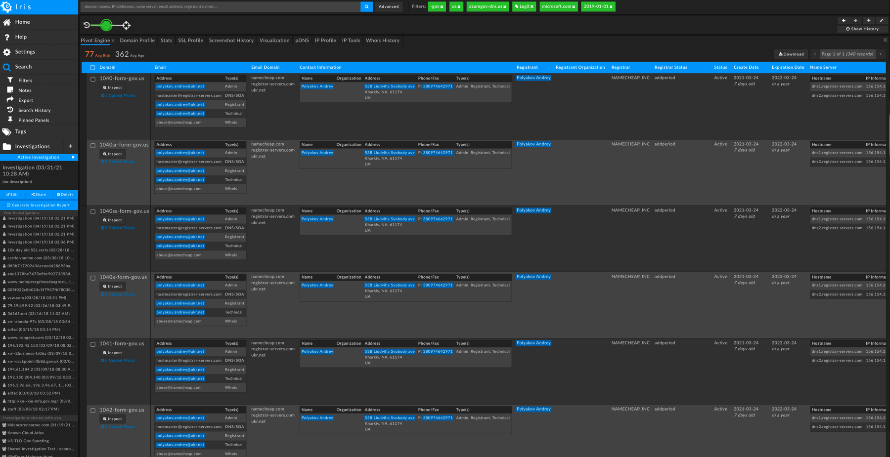

and turning them into an interactive 3D graph visualization where you can explore them by rotating, panning, and 
zooming into the the data to identify interesting subsets of domains are connected to each other. 


Or a 2D graph visualization where you can zoom in, select a set of domains and view exactly what pivots 
connect those specific domains together.


So what is a “graph” in this context? A graph is just a bunch of nodes, or circles that represent domains, 
connected together by edges, or gray lines that represent the pivots two domains have in common. In the graph examples 
above you can see that some domains group tightly together with others to create clusters. Why is this? 

Pairs of domains that have more pivots in common with each other will have "stronger" edges and be closer together. 
This layout logic will naturally cluster groups of highly connected domains together into these clusters. 

Pairs of domains that have only one or two pivots in common have "weaker" edges, and will be farther apart. These
domains will appear farther out on the periphery of the graph. If the domain(s) you are investigating are in this 
set of periphery nodes, then you know right away that your search is going in the wrong direction and you might want 
to go back to Iris and adjust our search criteria.

## Quick Primer on Jupyter Notebooks
DomainCAT is written in [Jupyter Notebooks](https://jupyter.org/), a web-based interactive environment that lets you 
combine text, code, data, and interactive visualizations all into one environment. Notebooks are broken up into 
cells, where each call can have either code or text. Don't worry, you don't have to know how to code python or make any 
changes to the code (mostly) to use DomainCAT, just how to run a cell. 

The video below is an example of how to run a cell. Just click into a cell and you'll see a blue bar on the left 
that indicates the cell now has focus. Then hit Shift+Return to run the cell. There is a little empty circle in the 
upper right of a notebook that fills in gray while the cell is running. When the cell is finished running, the 
circle becomes empty again, and there will be some sort of output below the code cell that is the results of what 
was run.

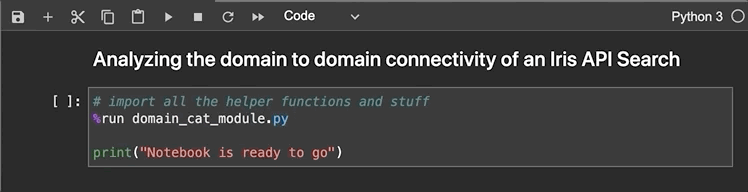

_Note: if you happen to double-click any of the text cells, you might see the contents change font and you'll have a 
blinking cursor. Don't panic, this just means you are in edit mode. Just hit Shift+Return like you were running a 
code cell, and the text will change back to normal._

If you happen to edit the code by accident and mess things up, it's not a big deal. You can click into the cell 
that you changed and use the normal undo/redo hotkeys (or the Edit menu) to get the code back to where it was before 
you edited it. Worse case you can just rebuild the docker container, and you'll get a new unedited notebook with all 
the default values.

## Initializing The Notebook

When you start the DomainCAT notebook, you'll need to click into and run the first code cell in the notebook. 
This will initialize all the code to do the connectivity analysis. You'll need to do this every time you start the notebook. 


## Setting Iris REST API Credentials

There are two ways you can enter your Iris REST API credentials. The first is entering them into this cell. 
The password textbox will not show the password in clear text.

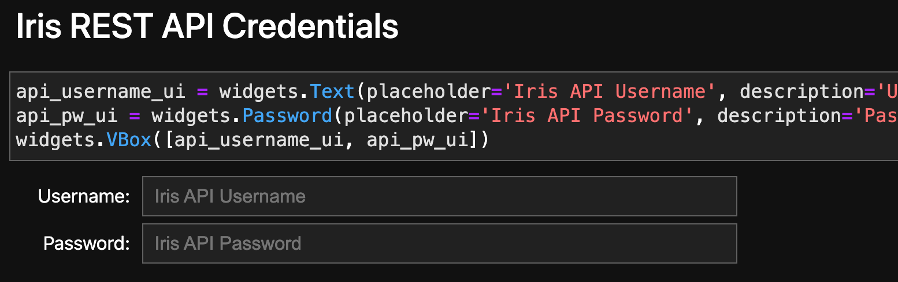

Alternatively you can create a `.env` fine in the root folder of the DomainCAT project and add the following block
to it, replacing the username and password with your own

```
# IRIS REST API CREDS
IRIS_API_USERNAME=some_user_name
IRIS_API_KEY=some_password
```

When the Jupyter Notebook initializes, the `dotenv` library will read the `.env` file and inject the credentials 
into the REST API calls

## Entering Domains To Query

The next step is to define the list of domains to query. This cell lets you do this in one of two ways.

First, you can enter the raw list of domains into the large spare textbox shown below. The domains can be 
either new-line or comma delimited, and DomainCAT support defanged domains that use square brackets.   

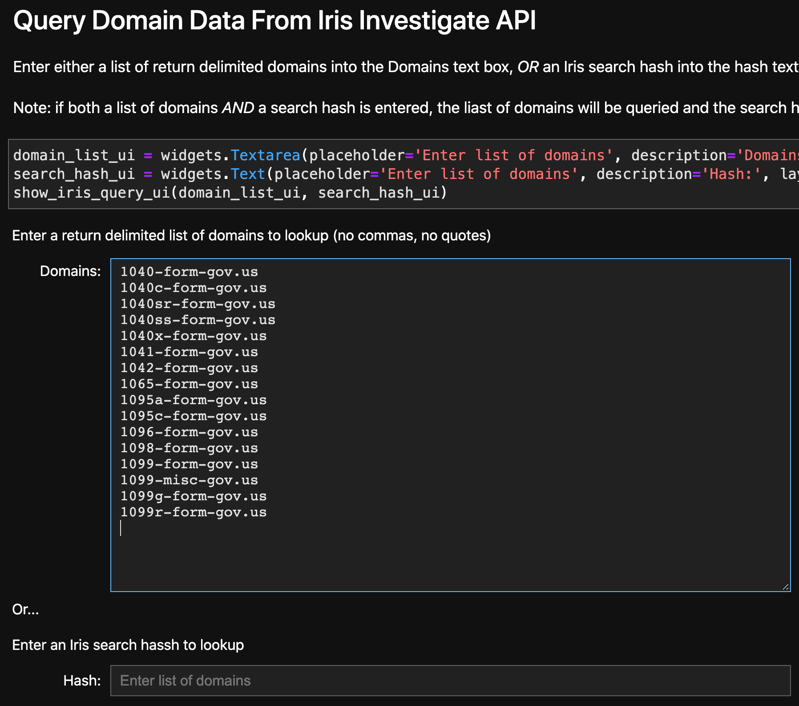

The second way is to enter an Iris investigation search hash into the second text box. This hash represents
an existing investigation in Iris and will query all the domains from the investigation. 

## Reading Domain Data From DomainTools REST API

DomainCAT reads domain data by querying the 
[DomainTools Iris Investigate REST API](https://www.domaintools.com/resources/api-documentation/iris-investigate) 
for any investigation hash that you generate in the Iris UI.   

The next code cell (shown below) has the configuration used to query the Iris REST API.

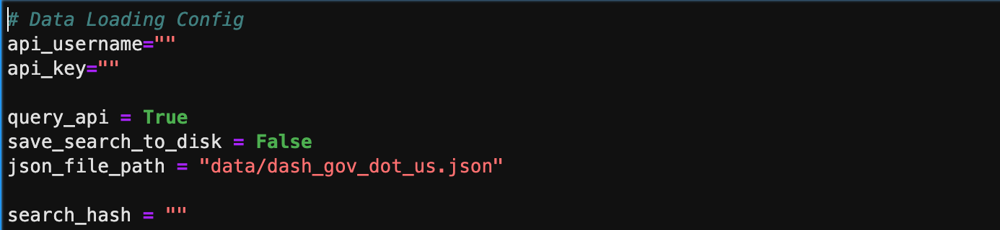

If you run the cell (Shift+Return) DomainCAT will query the REST api using the investigation hash are return the set of 
domains from the list of domains you enterd or the Iris search hash. It will also show you the number of domains loaded
into the notebook.

There are a couple of options to note:
- `save_search_to_disk`: if you change this to `True` the search results will be saved to disk. This way you can 
  reload the set of domains from your investigation at a later point without having to query the REST API again
- `json_file_path`: this is the path and file name used to save your search results to disk for later use
- `query_api`: if `True`, the REST API will query the investigation hash. If `False`, domain data will be loaded 
  from the `json_file_path`

DomainCAT ships with a demo dataset of ab called `dash_gov_dot_us.json`. This is a set of domains that use 
the `.us` TLD, end in `-gov`, and are less than 2 years old. To load this data set `query_api` to False and run the cell.

_Performance Note: DomainCAT performs best with less than or equal to 400 domains(ish). Any more than that and 
performance and memory can become an issue and cause the notebook to crash._

## Configuration Settings

There are a set of configuration settings that for the most part you shouldn't need to change

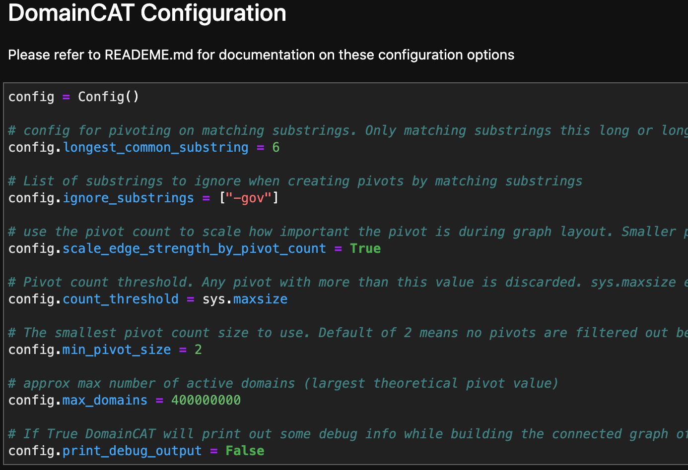

### config.active_domains_only (default: True)
If this setting is `True` DomainCAT will only analyze domains that are activly registered. Domains that were taken down or expired will be ignored. If `False`, all domains returned by Iris REST API will be analyzed.

### config.longest_common_substring (default: 6)

DomainCAT has a new type of pivot called `longest_common_substring`. It compares every domain name to every other 
domain name, and creates a pivot between two domains if they share `longest_common_substring` or more consecutive 
characters. For example, the domains visas-esta-gov[.]us and visas-estausa-gov[.]us both share the substring 
“visas-esta”, so a pivot would be created for the value “visas-esta” that will join every domain with this substring.  

Note: I've found anything less than 5 for this setting will create way too many connections in the domain graph, 
and are not useful in an investigation. But try it if you want, it creates a pretty graph.

### config.ignore_substrings (default: empty)

This setting is an array of string values to ignore when looking for `longest_common_substring` pivots. This is useful 
when you use a string as part of Iris search, like all domains ending in "-gov". Every domain will have this substring, 
so you want to remove it from consideration when creating substring pivots. 

To turn this setting off, use: `config.ignore_substrings = []`

If you have more than one string to ignore use the following pattern: `config.ignore_substrings = ["stuff", "things", "hotsauce"]`

### config.scale_edge_strength_by_pivot_count (default: True)

Every pivot in Iris has a pivot count. This is the number of domains globally attached to this pivot. For example, 
an ip address might have a pivot count of 1,000, meaning there are 1,000 domains hosted on this ip address. DomainCAT 
also has a notion of _local pivots_; these are pivots between domains only within the REST API search results.  

When evaluating how important a pivot is between two domains, DomainCAT can evaluate the global pivot count and weigh 
the influence of the pivot in the graph inversely proportional to the global pivot count. This means pivots with a 
smaller pivot count would have edges that are stronger in the graph than pivots with a very large global pivot count. 

If this is set to `True`, DomainCAT will use this graph edge weighting strategy. If it is set to `False`, it will 
weigh every edge equally.

*TODO: put link to section below about graphs, edges, and weights()

### config.count_threshold (default: sys.maxsize)

This setting is used to filter out pivots that have a global pivot count greater than `count_threshold`.  So if it was set to `config.count_threshold = 1000`, then any pivot that had a count greater than 1,000 would not be used to create an edge in the graph. 

This setting isn't that useful when `scale_edge_strength_by_pivot_count` is turned on, as the inverse weighting will take care of this. But if `scale_edge_strength_by_pivot_count` is turned off, it can be useful for weeding out really big pivots from commodity internet infrastructure.  

### config.min_pivot_size (default: 2)

This setting is used to filter out pivots that have a _local pivot size_ of less than `min_pivot_size`. For example, if this was set to 5, then any pivot that connects 4 or less domains returned from the REST API would be removed.

The default value of 2 keeps every pivot that connects at least 2 domains.

### config.max_domains (default: 400000000)

This setting is related to `scale_edge_strength_by_pivot_count`. It is the theoretical maximum number of domains that could ever be on a pivot and is used to calculate the inverse pivot count weight. The default value is the approximate number of active domains, give or take a few million: 400,000,000

### config.print_debug_output (default: False)

This setting is used to write extra debug info to the Jupyter's log to help with troubleshooting. 

## Choose Pivots & Build the Domain Graph

By default, all pivots are turned on,  (with a few exceptions discussed below). This means that if any two domains returned
by the REST API are connected to each other by any of the below pivots, they will have an edge created to connect them 
together in the graph.

To turn a pivot off, just comment out the pivot by putting a `#` in front of the pivot. For example, to turn off
the `create_date` pivot, just change the line like so:

```python
#    "create_date",
```

To turn a pivot back on, just remove the `#`. After any change to the code in a cell, you will have to re-run the
cell for the code change to take effect.

Below are the default pivot settings:

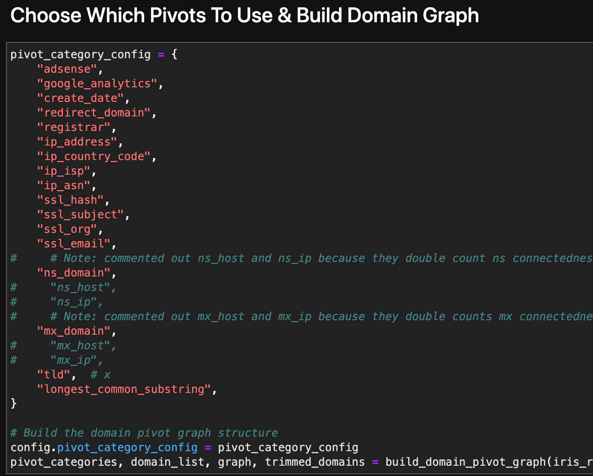

You'll note that `ns_host` and `ns_ip` are both commented out. This is because I prefer to use `ns_domain` for name
server based pivots. For example, if a domain has 4 name servers like:
- ns1.somedomain.com
- ns2.somedomain.com
- ns3.somedomain.com
- ns4.somedomain.com

`ns_host` will create a pivot for each one, and if each name server has its own IP address then there will be 
an additional 4 pivots created. That means if two domains share the above name servers, the edge in the graph that
connects them will represent a total of 9 pivots. This does two things to the graph. First I've found that this 
overemphasis the name server connectedness in the graph. Second, domains with more nameservers will have stronger 
edges than domains with fewer name servers, emphasising domains with more redundant infrastructure. The same logic 
applies to for MX record based pivots. 

Once you have the pivots turned on/off the way you want run this cell. DomainCAT will take all the domains returned
by the Iris REST API, analyze their shared pivots, and build a graph that represents the connected structure of 
these domains.

### Brand New Pivot: longest common substring!
Some might have noticed that there is a new pivot in this list that doesn’t exist in Iris called “longest_common_substring”. 
This is a new local pivot that was added into DomainCAT which compares every domain name in the search to every other 
domain name, and creates a pivot between two domains if they share 6 or more consecutive characters. For example, 
the domains visas-esta-gov[.]us and visas-estausa-gov[.]us both share the substring “visas-esta” so they would be 
connected in the graph. 

In fact, you can even turn off all the pivots except “longest_common_substring” which would show how connected all 
the domains are based solely on how they were named. This technique can be useful when your investigation centers 
around domain name patterns and shared infrastructure.

## Trimmed Domains

When building the graph of connected domains, there will often be a few domains that are not connected to any other
domain. These are called trimmed domains. DomainCAT will show you a count of domains that were trimmed from the
graph because they were not connected. 

If you want to see which domains were trimmed out, just run the next cell in the notebook and it will print out
the list of trimmed domains. 

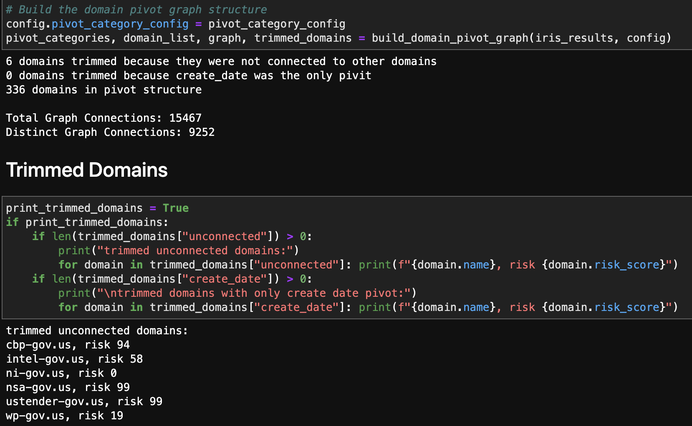

## Explore the 3D Domain Graph

Once the graph is built it's time to visually explore it. Run the next cell in the notebook:

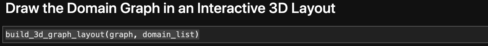

DomainCAT lets you explore the graph of connected domains with an interactive 3D view. You can mouse over any node 
and see what the domain name is and click/drag the graph to view it from different directions. This 3D view is really 
useful for gaining an understanding of the overall aggregate connectedness of all the domains, and if there are any 
clusters of domains that we might want to explore.

But if you haven't turned any pivots off, your graph might look a little something like this:


There are so many pivots in this graph, represented by those gray lines, that it obfuscates the visualization and 
really makes it hard to see what's going on, especially in the center of the graph. This is because there are some 
pivots that belong to most of the domains in the graph, resulting in a crazy spider web egg-sac-looking thing
like above. The good news is that not all pivots are as useful in every investigation, so we can remove them 
from the graph. 

For example; the search used to pull these domains together used the TLD “.us”. So every domain would have this pivot 
connecting it to every other domain. Luckily, DomainCAT is smart enough to look for pivots like that and automatically 
remove them. But there are probably other pivots that are just adding noise to the graph and do not offer much value 
to the investigation which we can turn off.

## Pivot Stats

DomainCAT has a Pivot Stats view, which shows different statistics for each pivot that was found in the domains. 

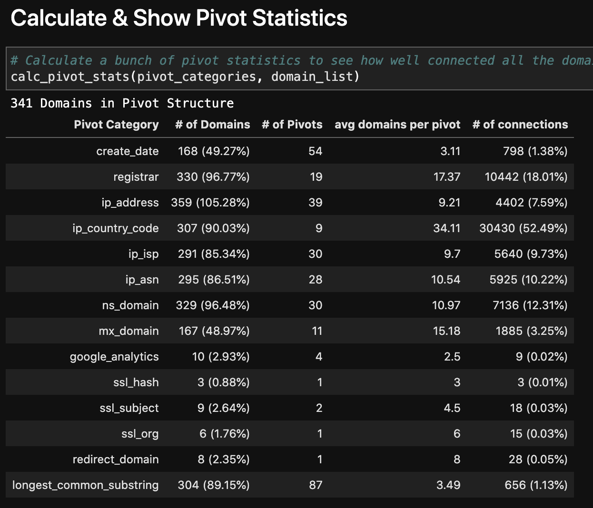

Looking through this list, we can see that `ip_country_code` only has 7 pivots (“# of Pivots”), meaning there were 
only 7 different country codes found in the domains, but it’s “# of connections” shows that almost 48% of the domains 
are connected to each other with this pivot. This is a good candidate pivot to turn off in the graph and should clean 
up the 3D view of the graph a bit.  

Let’s find out. Go back up to the pivots configuration cell and comment out `ip_country_code`, then run that cell 
to rebuild the graph.  Then scroll down to the cell that calls `build_3d_graph_layout(graph, domain_list)` to redraw 
the 3D visualization. It should look something like this:


Removing a single pivot really opened up the graph! As the 3D view of the graph pivots around we can see there are four 
main clusters: three that seem highly connected to each other, almost in a triangle, and one fairly mixed cluster 
pushed farther out to the side.

## Pivot Tuning: An Iterative Process

The 3D graph view looks pretty good after just turning off country code, but sometimes turning off one pivot isn’t 
enough. I call this process “pivot tuning;” you look at the 3D view of the graph to see if the center has opened up 
enough to see its internal cluster patterns. If the graph view is still too cluttered, look at pivot statistics and 
see if you can find another pivot that might be a good candidate to turn off. Pivots whose “# of connections” column 
is higher than 15% are often good candidates. Also, pivots whose “# of pivots” column is pretty low but the “# of 
domains” is close to 90% or greater can be helpful too. There are some pivots, like ASN or IP country code that are 
very coarse and apply to a high percentage of the domains. If your investigation isn’t centered around IP geo or 
network diversity, these pivots are also good candidates to turn off. 

You’ll get a feel for what works and what doesn’t as you play with it. But keep in mind that a pivot that looks 
like a candidate to turn off might be critical to your investigation. For example; if the investigation is centered 
around domains hosted by a single ISP, turning off “ip_isp” might be a good idea, but “ip_address” might remove 
important connectivity information from the graph.

_Note: I like to have multiple cells that call `build_3d_graph_layout(graph, domain_list)`. This way, as I'm 
pivot tuning, I can really see how a change in the pivots affected the graph by comparing it to the
previous graph. I'll often have 3 or 4 different 3D graphs showing my progress while pivot tuning_

## Explore the 2D Domain Graph

With the 3D graph cleaned up a bit we can now dive back into the 2 dimensional view to explore the details of the 
different domain clusters or individual domains. 

Run the next cell to create the interactive 2D domain graph.

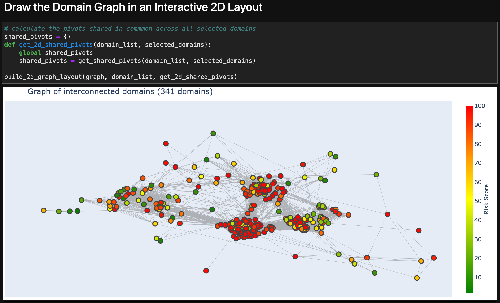

There are several things we can do in this view of the graph. We can zoom into a cluster to look at what domains are 
in it. To do this, just click-drag over a section of the graph you want to zoom into. To zoom back out click the
little house icon in the upper right of the 2D graph view.

A large cluster is sometimes actually made up of 2-3 smaller clusters that are useful to explore, but just lump 
together in the zoomed-out view. If common domain name patterns are a theme in your investigation, 
mousing over domains to view their name is a useful tactic to see which domains are grouped together.


We can also select a region of the graph (which is different from zooming in) by clicking either the "box select"
or "lasso select" icons in the upper right of the 2D view, and then click-drag the region in the graph to select.  


Once a set of domains are selected (and all other domains become grayed out) DomainCAT will show the list of domain names.

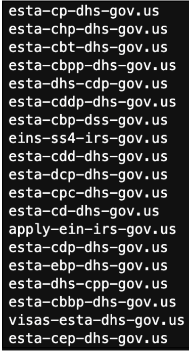

If this set of domains looks like what you are looking for in your investigation, you could export this list back 
into your SOAR playbook to build rules around them, or maybe add them to your firewall to block outright. Or if you 
could copy them back into Iris to do a more focused investigation just on these domains. 

## Dig into Pivot Connections

Once you have a set of selected domains, you can dig deeper into what pivots were influential in grouping them together.
Run the next cell in the notebook:

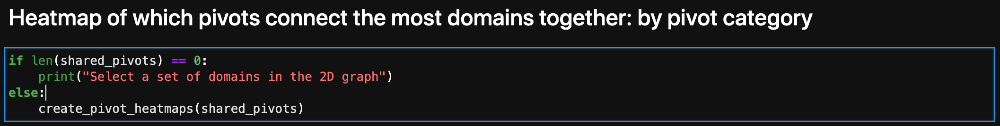

This will analyze all the pivots that are shared across the domains that you just selected, and show you a heatmap view
of which pivots were most influential in connecting the selected domains, ordered from most influential to least. 

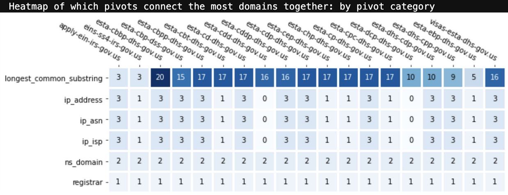

Looking at the list of selected domain names, it’s not a surprise that “longest_common_substring” was the most 
frequent pivot. The number in each square is the total number of pivots of that type from that domain to the other 
selected domains. *This view can tell you what pivot categories were most influential in grouping these domains 
together*. This information can be really valuable when your investigation didn’t include one of these 
pivots in the original search criteria.

If you want to look at which specific pivot values are responsible for clustering these domains together, the below 
view is a more detailed heat map which shows the actual pivot value rather than its key.

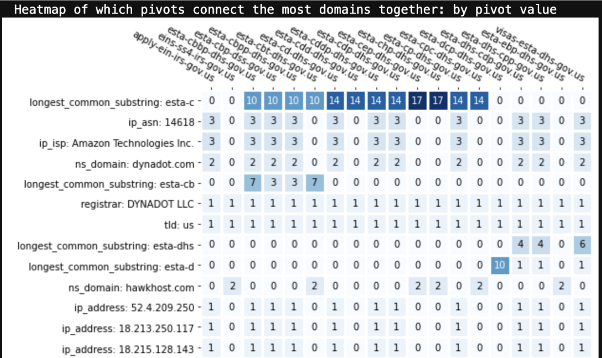

From this we can see that “esta-c” is a very common naming pattern for these domains. If this was a pattern in our 
source indicator(s), we might go back to Iris and add “domain contains esta-c” as an additional search criteria to 
bring in a broader set of domains into our investigation.

There is another interesting pattern in this view. If you look at the ASN, ISP, IP address, and dynadot[.]com name 
server rows you’ll see that they are all used by the same subset of domains in this list. But hawkhost[.]com nameserver 
is used by all the other domains. Based on the domain naming pattern it’s reasonable to believe that all these domains 
were created by the same actor, but it looks like this actor uses at least two different hosting and name server 
infrastructures. This realization could widen out the set of domains that you can now take action on. 

There’s one other piece of functionality in the 2D graph view that is worth mentioning. Sometimes you just want to 
see what domains are connected to one specific domain. If you click any node in the graph, it will automatically 
select all the nodes that are connected to it and you can then explore the pivots that bind them together.


This is useful when you have a seed domain in your investigation and you want to just dive right into it and see what 
other domains are connected to it. Another useful scenario (shown above) is when you see a “connector domain” that 
sits in between two clusters but is highly connected to both. Clicking on that domain and then inspecting the shared 
pivots can sometimes yield valuable information about two different infrastructure patterns used by a potential actor.

# DomainCAT Tips & Best Practices

## longest_common_substring
When investigating a set of domains that have obvious common naming patterns, it can be useful to turn off all pivots 
except `longest_common_substring` which would show how connected all the domains are based solely on how they were named. 
I'll also often combine `longest_common_substring` with only one or two other infrastructure based pivots, 
like `ns_domain` or `mx_domain`. This technique can be useful when your investigation centers around domain name 
patterns and shared infrastructure.

